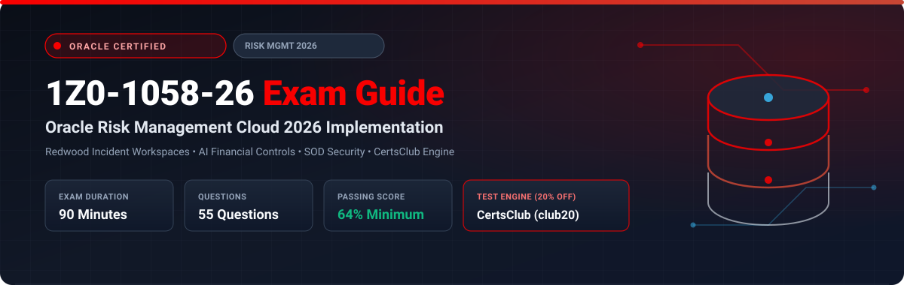

  

# Oracle Risk Management Cloud 2026 Implementation Professional (1Z0-1058-26) Exam Study Guide & Practice Test Resource Portal

[-f80000?style=for-the-badge&logo=oracle&logoColor=white)](https://education.oracle.com/)

[-28a745?style=for-the-badge&logo=shield)](https://www.certsclub.com/oracle/)

---

## 1. Exam Overview & Candidate Profile

The **Oracle Risk Management Cloud 2026 Implementation Professional (1Z0-1058-26)** exam validates that an implementation consultant possesses the modern skills required to deploy Oracle Fusion Cloud Risk Management with Redwood user experiences. The 2026 blueprint emphasizes AI-driven anomaly detection in financial transactions (Advanced Financial Controls), automated Segregation of Duties remediation in Redwood incident consoles (Advanced Access Controls), continuous controls monitoring, and enterprise audit risk scoring.

Passing 1Z0-1058-26 awards the **Oracle Risk Management Cloud 2026 Certified Implementation Professional** credential.

### Target Candidate Profile & Career Roles
* **Lead Risk & Compliance Functional Consultants**
* **Internal Controls & Security Audit Architects**
* **ERP Governance & Fraud Risk Analysts**

---

## 2. Key Exam Specifications

| Parameter | Official Specification |
| :--- | :--- |
| **Exam Code** | 1Z0-1058-26 |
| **Exam Title** | Oracle Risk Management Cloud 2026 Implementation Professional |
| **Associated Credential** | Oracle Risk Management Cloud 2026 Certified Implementation Professional |
| **Duration** | 90 Minutes |
| **Number of Questions** | 55 Questions |
| **Passing Score** | 64% |
| **Question Format** | Multiple Choice (Single and Multiple Select) |
| **Delivery Vendor** | Pearson VUE / Oracle University Online Remote Proctoring |
| **Recommended Practice Test Engine** | **[1Z0-1058-26 Practice Test - CertsClub](https://www.certsclub.com/oracle/)** (Coupon: `club20` for 20% off) |

---

## 3. Official Blueprint & Exam Domain Breakdown

| Domain Code | Domain Title | Weighting | Key Competencies Covered |
| :--- | :--- | :---: | :--- |
| **1.0** | **Advanced Access Controls (Redwood)** | **30%** | Access models, Redwood incident remediation, Segregation of Duties rules, Global entitlements. |
| **2.0** | **Advanced Financial Controls & AI Anomalies** | **25%** | Transaction models, Machine learning duplicate payment detection, Continuous control monitoring. |
| **3.0** | **Enterprise Compliance & Audit Matrices** | **20%** | Process-Risk-Control matrices, Control testing, Issue assignment and resolution workflows. |
| **4.0** | **Security Models & Synchronization Jobs** | **15%** | Security configuration, Synchronization jobs, Job roles and data security policies. |
| **5.0** | **Executive Risk Dashboards & OTBI** | **10%** | Real-time risk posture KPIs, Incident remediation aging, Audit dashboards. |

---

## 4. Scenario-Based Demo Question & Explanation

### Question 1: AI Anomaly Detection in AFC
**Scenario:** An enterprise wants to detect fraudulent vendor invoices that deviate from normal invoice amounts or exhibit suspicious duplicate payment patterns across multiple operating units.

Which feature in Advanced Financial Controls (AFC) performs this automated pattern evaluation?

A) Standard Payables Hold  
B) **Transaction Models** using advanced pattern matching and user-defined statistical filters  
C) General Ledger Allocation  
D) Fast Formula  

**Correct Answer:** **B**

**Detailed Explanation:**
* In Advanced Financial Controls (AFC), **Transaction Models** inspect transactional business objects (e.g., Invoices, Purchase Orders) across multiple attributes to flag suspicious statistical variances, duplicates, or split purchase transactions designed to circumvent approval limits.

---

## 5. Recommended Preparation Strategy & Practice Testing Engine

1. **Practice Incident Remediation in Redwood:** Build access models and test incident workflows in a 2026 pod.
2. **Practice with Full-Length Mock Exams:** Use **[CertsClub Oracle 1Z0-1058-26 Practice Tests](https://www.certsclub.com/oracle/)**.
   * Focuses on 2026 objectives and Redwood risk features.
   * Enter discount coupon code **`club20`** at checkout on [CertsClub](https://www.certsclub.com/oracle/) for an immediate 20% discount.

---

## 6. Official Documentation & References

* [Oracle Fusion Cloud Risk Management 2026 Documentation](https://docs.oracle.com/en/cloud/saas/risk-management/)
* [Oracle University 1Z0-1058-26 Exam Details](https://education.oracle.com/)
* [CertsClub 1Z0-1058-26 Practice Engine](https://www.certsclub.com/oracle/)
